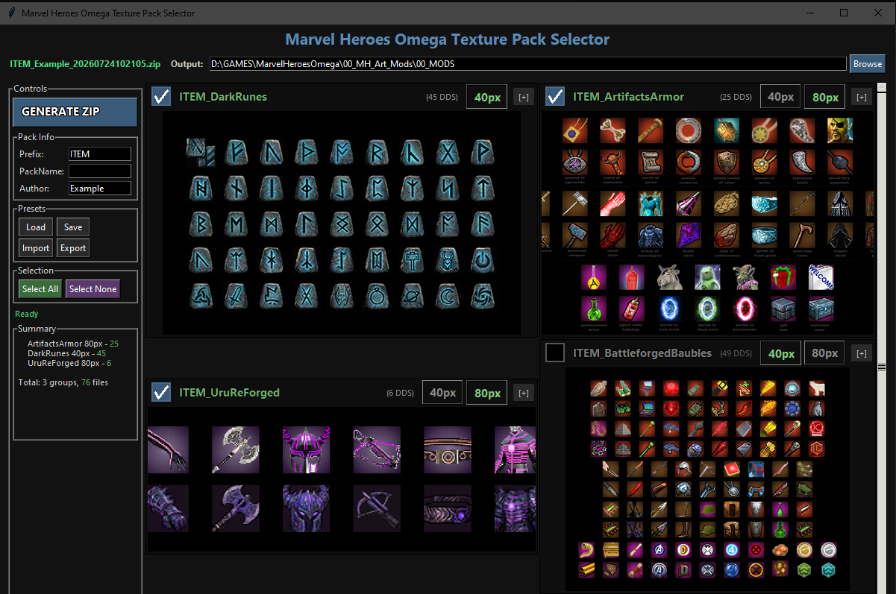
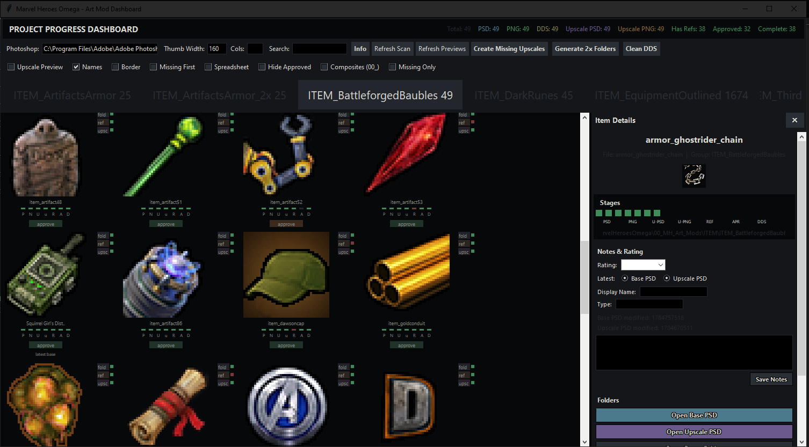
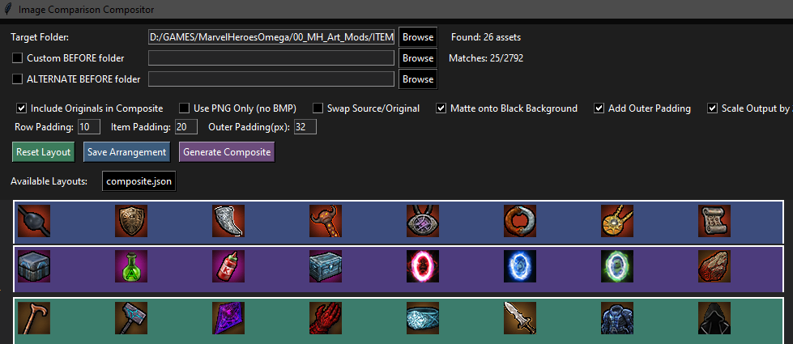

# Z_TOOLS - Marvel Heroes Omega Art Mod Toolchain

This folder contains the Python tooling used to create, compare, convert, and install the icon/texture art mods in this repo.  Each script is self-contained

---

## Tool Reference

### 1. `mho_01_mod_selector.py` - Variant-Aware Mod Selector / Installer

A Tkinter selector that groups related mod folders and lets you choose which folder-level variant to install for each mod.

**Supported variants**
- `base` - default 1x folder, e.g. `ITEM_ArtifactsArmor`
- `_2x` - 80px output folder, e.g. `ITEM_ArtifactsArmor_2x`
- `_no_outline` - outline-free folder, e.g. `ITEM_ArtifactsArmor_no_outline`

**Workflow**
1. Select the groups you want.
2. Pick the variant per group.
3. Click **Generate Manifests Only** (fast, uses existing `.dds`) or **Export DDS + Manifest** (re-converts sources).
4. Optionally copy the result to the MHModManager `data/mods` folder.

**Presets:** Saves/loads JSON presets to `mho_01_mod_selector_presets/` so configurations can be shared or committed.  Current settings are auto-saved to `mho_01_mod_selector_config.json`.

---

### 2. `mho_02_dashboard.py` - Art Mod Progress Dashboard

A project overview that scans every `ITEM/<GROUP>` folder and reports, per item, which assets exist:

- Base PSD source
- Base PNG export
- Base DDS conversion
- Upscale PSD / Upscale PNG
- Reference images
- `APPROVED::` flag from the item's markdown metadata

**Features**
- Thumbnail grid with color-coded status blocks
- Group filter buttons (left-click toggle, right-click solo)
- Spreadsheet mode for a compact table view
- "Create Missing Upscales" batch-copies base PSDs into `upscale/` folders
- "Generate 2x Folders" creates `<group>_2x` folders with 80px nearest-neighbor PNGs (skips items with PSDs in the 2x folder)
- Open item in Photoshop / Explorer
- Preview thumbnails cached in `_preview_cache_mh/`

**Config:** `mho_02_dashboard_settings.json`

---

### 3. `mho_03_dds_manifest.py` - Batch PSD/PNG -> DDS + Manifest

The main exporter.  Scans an `ITEM/<GROUP>` folder, converts every PSD or PNG it finds into a DDS texture, and writes a `manifest.json` that Marvel Mod Manager / the game understands.

**Key options**
- Source mode: PNG or PSD
- DDS format: `DXT5`, `BC3_UNORM`, `BC7_UNORM`, `BC7_UNORM_SRGB`, `R8G8B8A8_UNORM`
- BC quality: `normal` / `max` / `quick`
- DDS header: `Default` / `Force DX9` / `Force DX10`
- Mipmaps, premultiply alpha, total-replace on refresh
- Optional copy to the MHModManager `data/mods` target folder

**Tip:** For the game's older importer, `DXT5` + `Force DX9` is the safest combination.  Use `R8G8B8A8_UNORM` only if compression artifacts are still visible.

**Config:** `mho_03_dds_manifest_config.json`

---

### 4. `mho_04_icon_compositor.py` - Batch Item Icon Compositor

Composites 40×40 item PNGs onto a dark background with a tinted radial glow behind them.  Classification is automatic from the filename:

| Filename contains | Glow color |
|-------------------|------------|
| `unique`          | yellow/gold |
| `artifact` / `item_art` | orange |
| anything else     | purple |

**Workflow**
1. Set the `TARGET` folder, a radial mask image, background color, and reference pairs (one UNIQUE, one ARTIFACT).
2. Use **AUTO DEDUCE** to let `scipy` optimize the glow colors, brightness, and falloff to match your ground-truth composites.
3. Click **RENDER** to batch-process every PNG in the target folder into a `render/` subfolder.

Use this to re-create the standard "item icon look" for many icons at once.

**Config:** `mho_04_icon_compositor_config.json`

---

### 5. `mho_05_comparison_sheet.py` - Before / After Comparison Sheet

Builds a composite image showing original art side-by-side with the modded version.

**How it works**
- Point it at a mod folder (`TARGET`).
- It looks for BEFORE images in a `backup/` or `original/` subfolder, or in a custom BEFORE folder.
- It matches AFTER images in the target folder by filename stem.
- Optionally drag-and-drop items in the UI to arrange rows.
- Exports a final `composite.png` in the target folder.

Options include matte-black background, outer padding, 2× nearest-neighbor scaling, and alternate horizontal spacing.

**Config:** `mho_05_comparison_sheet_config.json`

---

## Configuration Files

| File | Owned by | Purpose |
|------|----------|---------|
| `mho_01_mod_selector_config.json` | `mho_01_mod_selector.py` | Last-used settings and selections |
| `mho_02_dashboard_settings.json` | `mho_02_dashboard.py` | UI layout, filters, Photoshop path |
| `mho_03_dds_manifest_config.json` | `mho_03_dds_manifest.py` | texconv path, author, DDS settings, target folder |
| `mho_04_icon_compositor_config.json` | `mho_04_icon_compositor.py` | Target, mask, reference pairs, colors |
| `mho_05_comparison_sheet_config.json` | `mho_05_comparison_sheet.py` | Folder paths, padding, layout options |

---

## Common Conventions

- **Source folders** are under `../ITEM` relative to this directory.
- **Items starting with `00_`** are composites, references, or group thumbnails, not individual mod items, and are ignored by the exporters.
- **Upscale folders** (`upscale/` or `Upscale/` inside a group) hold the 1024×1024 working files.  They are *not* the final 2× output; the final `_2x` variant lives at the `ITEM_<Name>_2x` folder level.
- **DDS output** is written next to its source file and referenced by `manifest.json`.

---
